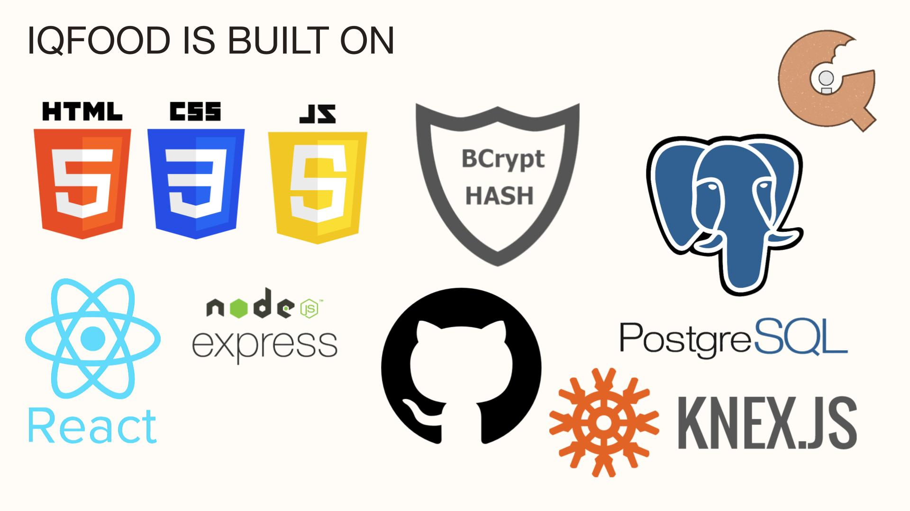

# iQFood

## Team

  - __Product Owner__: Luis Cordero
  - __Scrum Master__: Xhesika Malecaj
  - __Development Team Members__: Issac Sagesse, Arly Raymundo

### Getting Started

1. Fork this template repo
2. Create a PostgreSQL database
3. Create a `.env` file and define environment variables for your PostgreSQL credentials. See the `knexfile.js` file for needed variables.
4. Run the command `npm run kickstart`

## Requirements

- Node 0.10.x
- Postgresql 9.1.x
- knex
- react

## Mission Statement
 iQFood is a platform created in response to the numerous reports of individuals who have digestive issues that ultimately lead to cancer and a greater risk of passing away. By educating the public on the dangerous chemicals present in our food, identifying healthier alternatives, and helping to create grocery lists, our users can achieve a longer life span.

## Who We Serve
The app serves individuals who are concerned about the impact of processed foods on their health and are seeking information and alternatives.

## Product Overview
The application aims to address the issue of processed foods' health effects by providing resources and information about their chemical compounds, while also offering alternative food options for individuals with IBD/IBS/UC/Chronics (any other digestive problems) and a tool for building a healthy grocery list.

## Summary
iQFood is a place where the general public can be well-informed about the effects of processed foods one consumes and their impact on our bodies. With this information, individuals will be educated and aware of how much damage processed foods can do to our bodies. With that people will read about how they can make better decisions and create better dietary choices and meal plans to help with their health. While investing in unprocessed foods may appear financially burdensome, refraining from formulating meal plans or persisting with processed food consumption can incur substantial expenses over an extended period of time. iQFood increases awareness and informed decision-making contributing to positive dietary shifts and ultimately promoting a healthier population overall.

## Technologies

## ERD

## Key API Endpoints

| endpoint | description | example |
| - | - | - |
| `/api//itemslist` | Get all possible item options | `GET /api/items` |
| `/api/grocerylist/:id` | Get all possible grocery lists created by the users id | `GET /api/grocerylist/2` |
| `/api/grocerylist/:userId` | Creates a new grocery list  | `POST /api/grocerylist/3` |
| `/api/itemslist` | Creates a new item  | `POST /api/itemslist` |
| `/api/itemslist/:id` | Updates an item  | `PATCH /api/itemslist/:id` |
| `/api/grocerylist/:id` | Updates a grocery list  | `PATCH /api/grocerylist/:id` |
| `/api/grocerylist/:id` | Deletes grocery list  | `DELETE /api/grocerylist/:id` |
| `/api/grocerylist/:grocerylist_id/:item_id` | Deletes specific item in grocery list  | `DELETE /api/grocerylist/:grocerylist_id/:item_id` |

